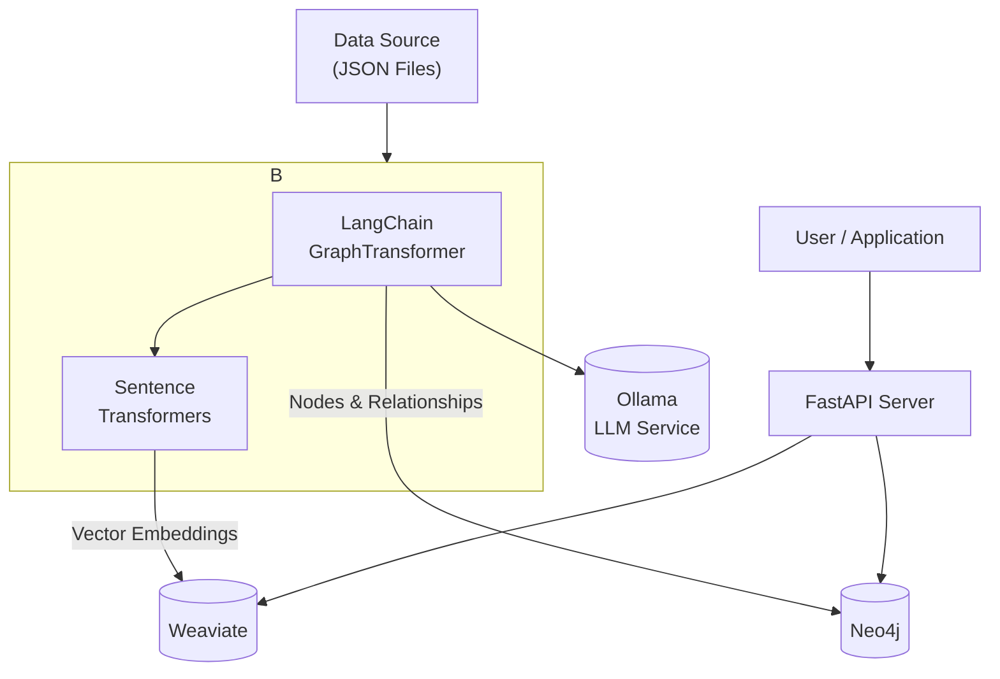

# LLM-Powered Enterprise Knowledge Graph - Working Prototype

This repository contains a working, containerized prototype of a scalable, open-source system for creating an Enterprise Knowledge Graph. It demonstrates a complete, end-to-end flow from data ingestion to providing advanced search capabilities via a modern API.

This version uses a Large Language Model (LLM) via **Ollama** and **LangChain** to perform sophisticated entity and relationship extraction, creating a rich, interconnected graph from unstructured text.

### Architecture Overview

This prototype implements a robust, LLM-centric architecture:

*   **Data Sources**: JSON files in the `./data/source` directory.
*   **LLM Service**: **Ollama** serves the `llama3:8b` model for intelligent text analysis.
*   **Ingestion & KG Construction**: A Python script (`ingestion_pipeline/`) that uses:
    *   **LangChain's `LLMGraphTransformer`** to send text to the LLM and receive structured graph data (nodes and relationships).
    *   **`Sentence-Transformers`** to create vector embeddings for semantic search.
*   **Knowledge Storage**:
    *   **Graph Database**: `Neo4j` to store the rich graph of entities and their relationships discovered by the LLM.
    *   **Vector Database**: `Weaviate` to store document embeddings for semantic search.
*   **Access Layer**: A `FastAPI` server (`api/`) providing endpoints for different types of queries.



### Prerequisites

*   Docker
*   Docker Compose

This setup is optimized for a Mac M1/M2 (ARM64) but will work on other architectures. **It is recommended to allocate at least 6-8 GB of memory to Docker Desktop.**

### Getting Started: Foolproof Workflow

Follow these steps precisely to ensure all services start in the correct order and are healthy before ingestion begins.

#### 1. Build the Custom Docker Images

This is a one-time command you run initially or whenever you change a `Dockerfile` or `requirements.txt`.

```bash
docker-compose build
```

#### 2. Start All Services

This command will start all background services (`Neo4j`, `Weaviate`, `Ollama`, and the `API`). Docker Compose will use the built-in `healthchecks` to ensure they are ready.

```bash
docker-compose up -d
```

#### 3. Wait for Services to Become Healthy

This is a critical step. Check the status of the containers. Wait until the **STATUS** for `neo4j_db`, `weaviate_db`, and `ollama_service` says **`(healthy)`**. This can take up to a minute.

```bash
docker-compose ps
```

#### 4. Pull the LLM Model

This is a one-time download. Once the Ollama service is healthy, you must pull the model it will use for analysis.

```bash
docker exec -it ollama_service ollama pull llama3:8b
```

#### 5. Run the Ingestion Pipeline

Now that all services are confirmed healthy and the model is downloaded, run the ingestion script. This will load the default 3-document sample dataset.

```bash
docker-compose run --rm ingestion
```

After the script finishes, your knowledge graph is populated and ready to be queried.

### How to Use the API

The API server is running and available at **[http://localhost:8000](http://localhost:8000)**.

#### Semantic Search

Find documents semantically related to a query.

```bash
curl -X POST "http://localhost:8000/query/semantic" \
-H "Content-Type: application/json" \
-d '{
  "query": "What is the status of the Phoenix Project?"
}'
```

#### Graph Search

Find entities by name and see which documents they are mentioned in.

```bash
curl -X POST "http://localhost:8000/query/graph" \
-H "Content-Type: application/json" \
-d '{
  "entity_name": "Innovate Inc"
}'
```

---

### Creating a More Compelling Demo (Optional)

To showcase the true power of this architecture at scale, you can generate and ingest a larger, 500-document dataset. This demonstrates how the system uncovers insights that are impossible to find manually.

#### 1. Generate the Sample Data

First, run the data generator script. This will create a new file at `data/source/generated_docs.json`.

```bash
# This uses the ingestion container's environment to run the generator script
docker-compose run --rm ingestion python data_generator.py --count 500
```

#### 2. Ingest the Large Dataset

Wipe the databases and re-run the ingestion pipeline, but this time, point it to the newly generated 500-document file.

```bash
# Stop and completely remove the old database volumes
docker-compose down -v

# Start the services again
docker-compose up -d

# Wait for all services to become healthy
docker-compose ps

# Re-run the ingestion, overriding the data source path
docker-compose run --rm -e DATA_SOURCE_PATH=/app/data/source/generated_docs.json ingestion
```
**Note:** This ingestion will take much longer (20-30+ minutes) as the LLM processes all 500 documents.

#### 3. Showcase Emergent Intelligence in Neo4j

After the ingestion is complete, go to the Neo4j Browser (**[http://localhost:7474](http://localhost:7474)**) and run these more advanced queries to demonstrate knowledge discovery.

**Query 1: Find the Most Influential People**
*   *Shows who the key players are based on their number of connections.*
    ```cypher
    MATCH (p:Person)-[r]-()
    RETURN p.id AS person, count(r) AS connections
    ORDER BY connections DESC
    LIMIT 10
    ```

**Query 2: Uncover Hidden Teams**
*   *Finds pairs of people who work on the same project, revealing collaborations.*
    ```cypher
    MATCH (p1:Person)-[:WORKS_ON]->(proj:Project)<-[:WORKS_ON]-(p2:Person)
    WHERE p1 <> p2
    RETURN p1.id AS person1, proj.id AS project, p2.id AS person2
    LIMIT 15
    ```

---

### Next Steps: From Prototype to Production

1.  **Workflow Orchestration**: Replace manual script execution with **Apache Airflow**.
2.  **Scalable Deployment**: Migrate from `docker-compose` to **Kubernetes**.
3.  **Security & Management**: Place an **API Gateway** (e.g., Kong, Tyk) in front of the API.
4.  **UI Development**: Build a **React** or **Vue** frontend for search and graph visualization.
5.  **Live Data Connectors**: Expand the ingestion pipeline to pull data from real enterprise systems.