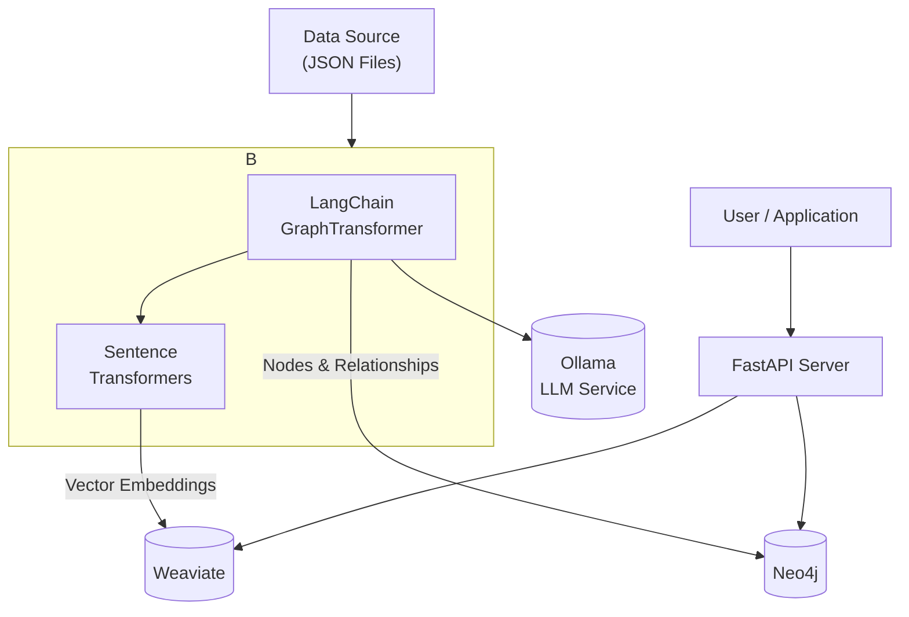

# LLM-Powered Enterprise Knowledge Graph - Working Prototype

This repository contains a working, containerized prototype of a scalable, open-source system for creating an Enterprise Knowledge Graph. It demonstrates a complete, end-to-end flow from data ingestion to providing advanced search capabilities via a modern API.

This version uses a Large Language Model (LLM) via **Ollama** and **LangChain** to perform sophisticated entity and relationship extraction, creating a rich, interconnected graph from unstructured text.

### Architecture Overview

This prototype implements a robust, LLM-centric architecture:

*   **Data Sources**: JSON files in the `./data/source` directory.
*   **LLM Service**: **Ollama** serves the `llama3:8b` model for intelligent text analysis.
*   **Ingestion & KG Construction**: A Python script (`ingestion_pipeline/`) that uses:
    *   **LangChain's `LLMGraphTransformer`** to send text to the LLM and receive structured graph data (nodes and relationships).
    *   **`Sentence-Transformers`** to create vector embeddings for semantic search.
*   **Knowledge Storage**:
    *   **Graph Database**: `Neo4j` to store the rich graph of entities and their relationships discovered by the LLM.
    *   **Vector Database**: `Weaviate` to store document embeddings for semantic search.
*   **Access Layer**: A `FastAPI` server (`api/`) providing endpoints for different types of queries.



### Prerequisites

*   Docker
*   Docker Compose

This setup is optimized for a Mac M1/M2 (ARM64) but will work on other architectures. **It is recommended to allocate at least 6-8 GB of memory to Docker Desktop.**

### Getting Started: Foolproof Workflow

Follow these steps precisely to ensure all services start in the correct order and are healthy before ingestion begins.

#### 1. Build the Custom Docker Images

This is a one-time command you run initially or whenever you change a `Dockerfile` or `requirements.txt`.

```bash
docker-compose build
```

#### 2. Start All Services

This command will start all background services (`Neo4j`, `Weaviate`, `Ollama`, and the `API`). Docker Compose will use the built-in `healthchecks` to ensure they are ready.

```bash
docker-compose up -d
```

#### 3. Wait for Services to Become Healthy

This is a critical step. Check the status of the containers. Wait until the **STATUS** for `neo4j_db`, `weaviate_db`, and `ollama_service` says **`(healthy)`**. This can take up to a minute.

```bash
docker-compose ps
```

#### 4. Pull the LLM Model

This is a one-time download. Once the Ollama service is healthy, you must pull the model it will use for analysis.

```bash
docker exec -it ollama_service ollama pull llama3:8b
```

#### 5. Run the Ingestion Pipeline

Now that all services are confirmed healthy and the model is downloaded, run the ingestion script. It will connect to the LLM to process your documents.

```bash
docker-compose run --rm ingestion
```

After the script finishes, your knowledge graph is populated and ready to be queried.

### How to Use the API

The API server is running and available at **[http://localhost:8000](http://localhost:8000)**.

#### Semantic Search

Find documents semantically related to a query.

```bash
curl -X POST "http://localhost:8000/query/semantic" \
-H "Content-Type: application/json" \
-d '{
  "query": "What is the status of the Phoenix Project?"
}'
```

#### Graph Search

Find entities by name and see which documents they are mentioned in. Notice how the `type` is now specific (e.g., `["Organization"]`), thanks to the LLM.

```bash
curl -X POST "http://localhost:8000/query/graph" \
-H "Content-Type: application/json" \
-d '{
  "entity_name": "Innovate Inc"
}'
```
**Expected Output:**
```json
[
  {
    "entity": "Innovate Inc",
    "type": [
      "Organization"
    ],
    "mentioned_in_docs": [
      "doc-001",
      "doc-002"
    ]
  }
]
```

#### Retrieval-Augmented Generation (RAG) Simulation

Get the context and prompt that would be sent to an LLM to answer a question based on your data.

```bash
curl -X POST "http://localhost:8000/query/rag" \
-H "Content-Type: application/json" \
-d '{
  "query": "Who works for Innovate Inc?"
}'
```

### Exploring the Graph Visually

You can directly explore the rich graph created by the LLM.

1.  Open the **Neo4j Browser**: **[http://localhost:7474](http://localhost:7474)**
2.  Login with credentials `neo4j` / `password124`
3.  Run this query to see the schema: `CALL db.schema.visualization()`
4.  Run this query to see the full graph: `MATCH (n)-[r]-(m) RETURN n,r,m`

### Next Steps: From Prototype to Production

This prototype provides a solid foundation. Here is a roadmap for evolving it into a production-grade solution:

1.  **Workflow Orchestration**: Replace manual script execution with a tool like **Apache Airflow** to schedule and monitor ingestion pipelines automatically.
2.  **Scalable Deployment**: Migrate from `docker-compose` to **Kubernetes** (e.g., EKS, GKE, AKS) for auto-scaling, high availability, and rolling updates.
3.  **Security & Management**: Place an **API Gateway** (e.g., Kong, Tyk) in front of the API to handle authentication, rate limiting, and centralized logging.
4.  **UI Development**: Build a **React** or **Vue** frontend that consumes the API endpoints, providing a search interface and using libraries like `vis.js` or `D3.js` for interactive graph visualization.
5.  **Live Data Connectors**: Expand the ingestion pipeline to pull data from real enterprise systems like PostgreSQL, Salesforce, or Confluence via their respective APIs or through Change Data Capture (CDC) with Debezium.