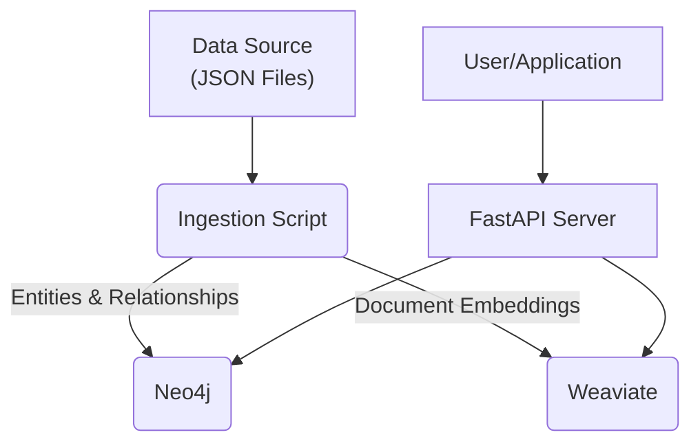

# Enterprise Knowledge Graph - Working Prototype

This repository contains a working, containerized prototype of a scalable, open-source system for creating an Enterprise Knowledge Graph. It demonstrates the core end-to-end flow from data ingestion to providing advanced search capabilities via a modern API.

### Architecture Overview

This prototype implements the following simplified architecture:

*   **Data Sources**: JSON files in the `./data/source` directory.
*   **Ingestion & KG Construction**: A Python script (`ingestion_pipeline/`) that uses `spaCy` for entity extraction and `sentence-transformers` to create vector embeddings. It simulates a full ETL/ELT process.
*   **Knowledge Storage**:
    *   **Graph Database**: `Neo4j` to store entities and their relationships.
    *   **Vector Database**: `Weaviate` to store document embeddings for semantic search.
*   **Access Layer**: A `FastAPI` server (`api/`) providing endpoints for different types of queries.



### Prerequisites

*   Docker
*   Docker Compose

This setup is optimized for a Mac M1/M2 (ARM64) but will work on other architectures.

***Note on Commands:*** *This guide uses the `docker-compose` (hyphenated) command. Newer versions of Docker use `docker compose` (with a space). If one command doesn't work, please try the other.*

### Getting Started

#### 1. Build the Docker Images

This one-time command builds the custom images for the ingestion and API services.

```bash
docker-compose build
```

#### 2. Start the Core Services

This command starts the databases (`Neo4j`, `Weaviate`) and the API server in the background.

```bash
docker-compose up -d neo4j weaviate api
```

*   **API Server**: Available at [http://localhost:8000](http://localhost:8000)
*   **Neo4j Browser**: Available at [http://localhost:7474](http://localhost:7474) (Use credentials `neo4j` / `password1234`)
*   **Weaviate**: Available at [http://localhost:8080](http://localhost:8080)

#### 3. Run the Ingestion Pipeline

With the services running, execute the ingestion script. This will read the data from `data/source/initial_documents.json`, process it, and load it into Neo4j and Weaviate.

```bash
docker-compose run --rm ingestion
```

You should see output indicating the models are loading, documents are being processed, and data is being saved.

### How to Use the API

You can use `curl` or any API client to interact with the system.

#### Semantic Search

Find documents semantically related to a query.

```bash
curl -X POST "http://localhost:8000/query/semantic" \
-H "Content-Type: application/json" \
-d '{
  "query": "information about the Phoenix Project"
}'
```

#### Graph Search

Find entities by name and see which documents they are mentioned in.

```bash
curl -X POST "http://localhost:8000/query/graph" \
-H "Content-Type: application/json" \
-d '{
  "entity_name": "Bob"
}'
```

#### Retrieval-Augmented Generation (RAG) Simulation

Get the context and prompt that would be sent to an LLM to answer a question.

```bash
curl -X POST "http://localhost:8000/query/rag" \
-H "Content-Type: application/json" \
-d '{
  "query": "Who is working on the Phoenix Project?"
}'
```

### Load Testing with Generated Data

You can generate more random data to test the system's performance.

#### 1. Generate New Data

Run the `data_generator.py` script. The following command generates 500 new documents and saves them.

```bash
docker-compose run --rm ingestion python data_generator.py --count 500 --output data/source/generated_docs.json
```

#### 2. Ingest the New Data

Run the ingestion pipeline again, but this time point it to your newly generated file.

```bash
docker-compose run --rm -e DATA_SOURCE_PATH=/app/data/source/generated_docs.json ingestion
```

### Next Steps: Integrating a Real LLM

This prototype is ready for integration with a Large Language Model (e.g., via Ollama).

1.  **Add Ollama to `docker-compose.yml`**:
    ```yaml
    # In services:
    ollama:
      image: ollama/ollama
      container_name: ollama_service
      ports:
        - "11434:11434"
      volumes:
        - ollama_data:/root/.ollama
      networks:
        - kg_network

    # In volumes:
    ollama_data:
    ```
2.  **Pull a model**: After starting Ollama, run `docker exec -it ollama_service ollama pull llama3`.
3.  **Modify the API**: In `api/main.py`, update the `/query/rag` endpoint to make an HTTP request to `http://ollama:11434/api/generate` with the generated prompt.